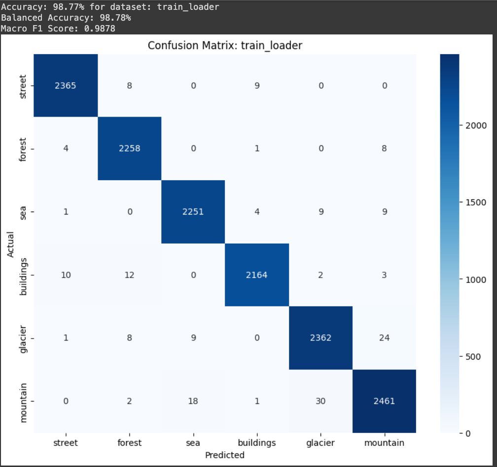
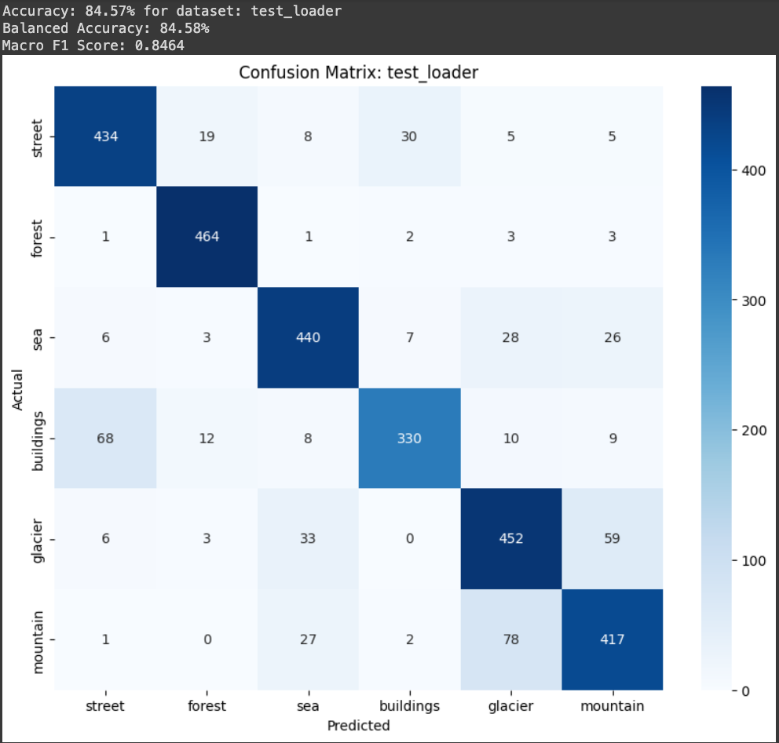

# Model Card

See the [example Google model cards](https://modelcards.withgoogle.com/model-reports) for inspiration. 

## Model Description

**Input:** The model takes coloyr images of sceens from all over the world with various dimations dimensions smallest, 76x150 to biggest 150x150 pixels. These images are not resized to match the input requirement of the CNN architecture asthe CNNt deals with this internally by dynamically catering for each image it processes. The task is to classify the non-classified images in the "pred" sub-dataset. 

**Output:** The model outputs a probability distribution over six classes: 'glacier', 'street', 'mountain', 'forest', 'sea', 'buildings'. The randomply picked images from the "pred" sub-dataset is predicted to be a member of one of the six classes and is plotted at the end.

**Model Architecture:** The model is a modified dynamic and enhanced LeNet-5, with the following changes:
- Input colour mages are not resized to match the input requirement of the CNN. The imaeges are with various dimations dimensions smallest, 76x150 to biggest 150x150 pixels.
- A third convolutional layer is added for better training performance.
- Dynamically adjust the first fully connected layer if necessary to accomodate the various sapes and size of the images.
- The final fully connected layer is modified to output predictions for six classes noted above.
- The Adam optimizer is used instead of SGD for better convergence and performance.
- Various hyperparameter otimisation tweaks are implemented for Optima.

## Performance

REMOVE Give a summary graph or metrics of how the model performs. Remember to include how you are measuring the performance and what data you analysed it on. REMOVE 
The model performs very well. Being trained on fourteen thousand samples and validated against three thousand samples the observed confusion matrix and accuracy is nearly 99% and 84% respectively. The data consists of a large and wide examples of real life scenes and it would seem that the model generalises well from all the complex data available. The predicted random samples from the con-classified data samples seem to hit the mark 100%, although, admittedly, with a prediction rndom sample set to 10, more predictions are needed so true performance can be observed:

## Limitations

Outline the limitations of your model.

## Trade-offs

Outline any trade-offs of your model, such as any circumstances where the model exhibits performance issues. 
